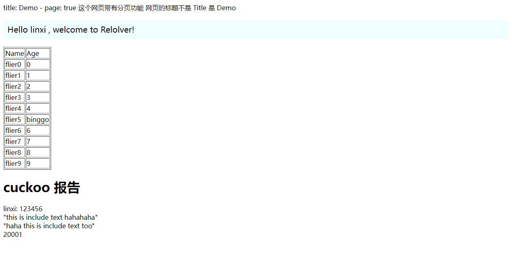
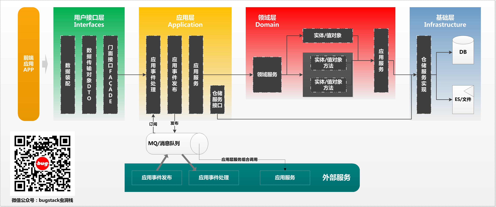
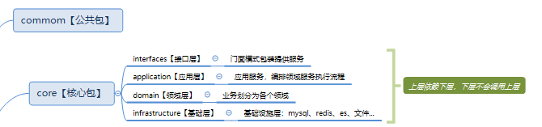
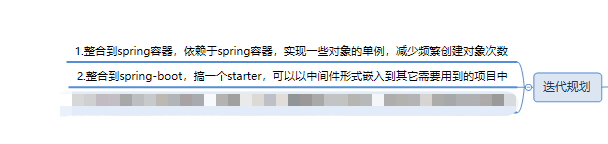
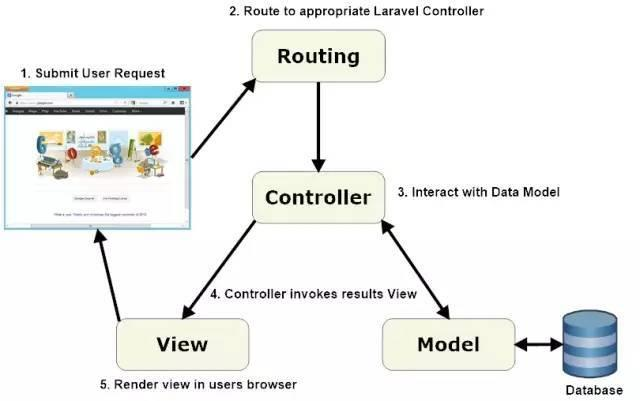
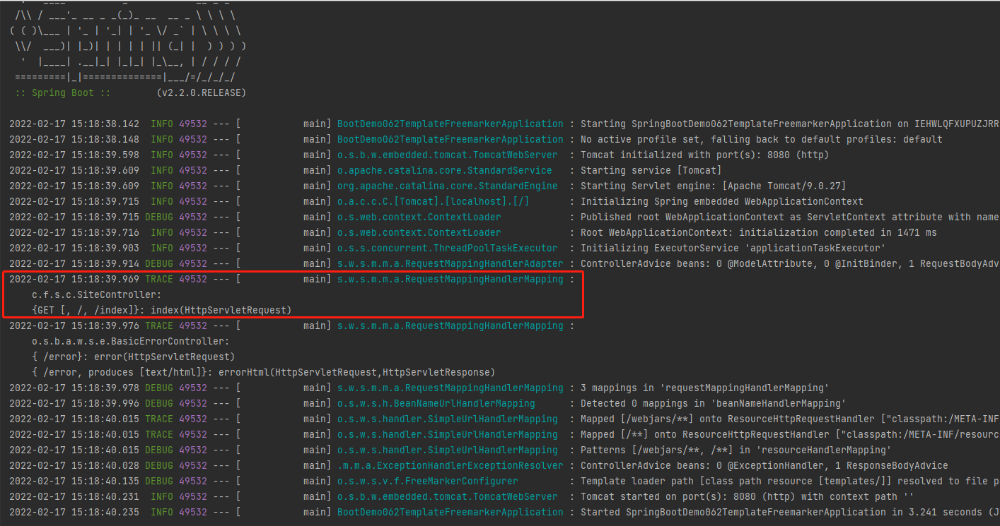

## relolver

简单的使用

1.打包 relolver-common、打包 relolver-core

2.运行 RelolverWebApplication

访问

http://127.0.0.1:8080/index

index页面源文件：

```
---
layout: default
title:Demo
page:true
---

<!DOCTYPE html>
<html lang="en">
<head>
    <meta charset="UTF-8">
    <title>index</title>
    <style type="text/css">
        .hello {
            background-color: azure;
            padding: 10px;
            font-size: 20px;
        }
    </style>
</head>
<body>
<p class="hello">
    Hello {{username | append: " , welcome to Relolver!" }}
</p>

<div class="container">
    <table border="1">
        <thead>
        <tr>
            <td>Name</td>
            <td>Age</td>
        </tr>
        </thead>
        <tbody>
        
        <tr>
            <td>{{user.name}}</td>
            
            <td>binggo</td>
            
            <td>{{user.age}}</td>
            
        </tr>
        
        </tbody>
    </table>
    
    
</div>
</body>
</html>
```

访问后展示效果：



## 字符串、模板文件类别渲染：

源文件：

```
直接渲染：
{{username}}:{{password}}


对象迭代： 【此功能列入计划但未完成】

{{key}}={{value}}



加上判断语句：

    hello, this is if



if else 语句：

    hello, this is if.

    hello, this is else if.

    hello, this is else.



if嵌套for：

    
        {{user.name}}
    



原生的：包含的内容不会进行解析

    {{username}}:{{password}}

    
        
            {{user.name}}
        
    

```

渲染代码：

```java
@Test
public void testRender() {
    String resource = "src/main/resources/template";
    String templateName = "template";
    String suffix = ".txt";
    JSONObject object = new JSONObject() {{
        put("username", "flier");
        put("password", "123456");
    }};
    List<User> users = new ArrayList<User>();
    for (int i = 0; i < 10; i++) {
        User user = new User();
        user.setName("flier" + i);
        user.setAge(i);
        users.add(user);
    }
    object.put("users", users);
    Map<String, String> map = new HashMap<>(2);
    object.put("object", map);
    String render = RelolverControl.render(resource, templateName, suffix, JSON.toJSONString(object));
    System.out.println(render);
}
```

执行结果：

```
com.flier.common.exception.ParamNotFoundException: object.keySet() is not collection or arrray
直接渲染：
flier:123456


对象迭代：


加上判断语句：


if else 语句：

    hello, this is else if.


if嵌套for：

    
        flier0
    
        flier1
    
        flier2
    
        flier3
    
        flier4
    
        flier5
    
        flier6
    
        flier7
    
        flier8
    
        flier9
    


原生的：包含的内容不会进行解析

    {{username}}:{{password}}

    
        
            {{user.name}}
        
    
```

另外有各种扩展函数功能，具体参考 test下pipline包的单元测试。

## 介绍

relolver，原身是solid，是我在github上面找的一个开源的模板引擎，搞下来基于它做了一些改动和重构，并且为了符合之后应用的一些需求，做了一些功能上的增强

参考ddd方法论对结构进行了重构【没完善】，上层编排调度下层，下层不会依赖上层







## 然后，随便聊聊

动态网页技术是一项古老的技术，动态页面渲染它的一个流程如下图所示



1.用户发起请求

2.web应用在初始化启动的时候会把url与对应controller保存路由，路由接收到用户的请求，根据请求的路径去映射中找到对应的处理器



3.在controller这部分的处理逻辑中我们可能会从用户的请求中的一些参数与和数据库产生数据交互，比如这里我们可以根据用户的id去数据库拿到该用户所有的关联信息（拿到需要的数据，我们会把它设定到请求域里面，后面会用到做数据的处理）

4.返回对应的view视图，但是还没有返回到用户的浏览器进行渲染，此时web应用的模板引擎会根据请求域中的数据，对view视图中的一些语法、标记 进行解释、渲染。

5.渲染后的视图返回到用户的浏览器，这时它是一个html文件，浏览器渲染其可视化展示给到用户看。


----------------
v0.0.6 补强函数功能，支持对象迭代，新加定制化函数（用空格补充空位展示起来好看点）